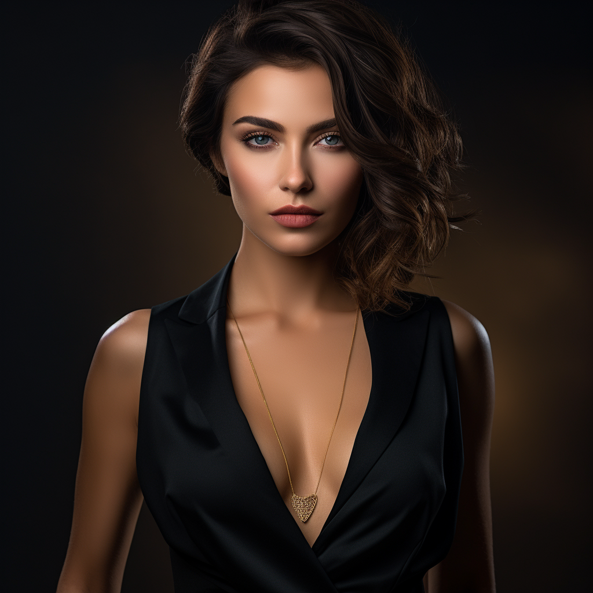

# midjourney-female-background-images-1024x1024px
AI generated images to use in social media as eye catching backgrounds

Examples:
<div>
  <a href="./black1.png" target="_blank"></a>
  <a href="./leather1.png" target="_blank"></a>
  <a href="./leather34.png" target="_blank"></a>
  <a href="./red4.png" target="_blank"></a>
</div>


Used Midjourney prompt:
```
Create a minimalistic dark-colored background image featuring a prominent and very attractive
blonde woman in shiny leather boots. The women should be intricately designed and sophisticated,
clearly visible despite the dark background. She could potentially be depicted as a curious
person or a cybernetic entity, symbolizing the power and potential of learning programming.
This background will be used as a motivational and empowering visual aid in a programming course.
```


